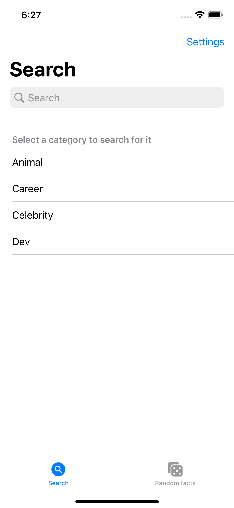
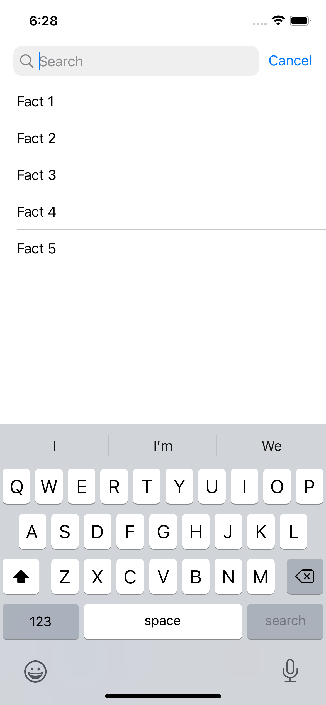
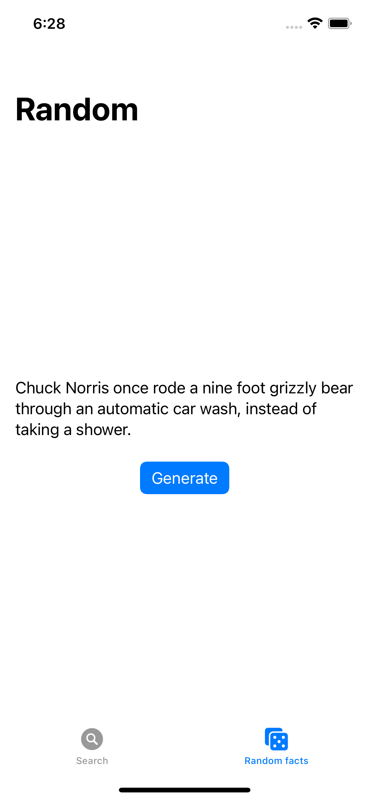
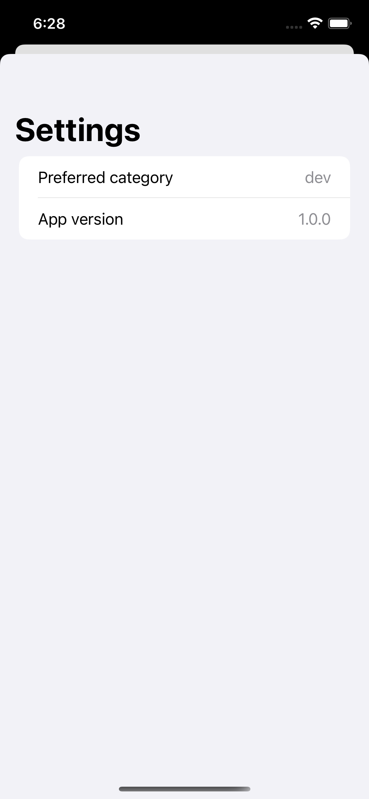

# MVVM Challenge - Chuck Norris App 💪

In this challenge, we will apply MVVM architecture concepts to finalize the implementation of an iOS application.

We will develop ViewModels and their tests, integration with APIs layer and communication patterns among the architecture layers.

# Contributing

1. Clone this repository.
2. Start a new feature branch. 
3. Open `solutions` folder and access your Dev Sprint's project.
4. Build, run and code! 👩‍💻

# About Devpass

Devpass is a diverse community of high-potential software developers accelerating their careers through real-world product development and mentorship from tech leaders of the best tech companies.

Interested? Access www.devpass.com.br for more information!

